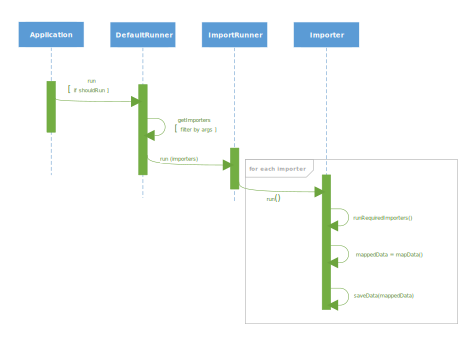
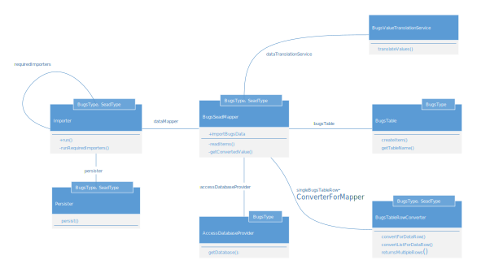
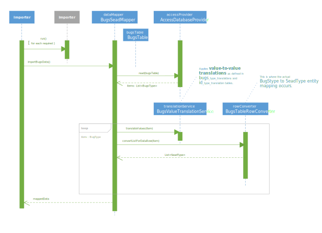

# SEAD Bugs Import

Preview markdown files in a separate window. Markdown is formatted exactly the
same as on GitHub.

[Overview](#overview) | [Prerequisites](#prerequisites) | [Installation](#installation) | [Usage](#usage) | [Command-line options](#options) | [Configuration](#configuration)

## Overview


## Prerequisites

For building and running the application you need:

- [OpenJDK 1.8](openjdk.org)
- [Maven 3](https://maven.apache.org)
- Spring Boot 1.5.20.RELEASE
- Spring Data JPA
- PostgreSQL Driver
- [Jackcess](https://jackcess.sourceforge.io/) - Java Library for MS Access
- Hibernate
- H2 in-memory database for running test suite

## Installation

```bash
$ git clone https://github/com/humlab/SEAD/sead_bugs_import
$ cd sead_bugs_import
$ mvn -Dmaven.test.skip=true clean package
```

## Usage

```
% java -jar jar-file --file="filename" [--importers=..] [--validate-schema]
```

### Options

* `--file=` - _string_ Bugs MS Access database file to import. (**required**)
* `--importers=` - _string_ Comma seperated list of importers to run.
* `--validate-schema` - Validate schema (create/update) but do not run.
* `--no-run` - Do not run.

## Steps to perform a bugs import

1. Verify application configuration
2. Setup the target database (e.g. sead_staging_bugs)
3. Download and unpack latest bugs database from [http://www.bugscep.com](http://www.bugscep.com/downloads.html), [link to file](http://www.bugscep.com/downloads/bugsdata.zip)
4. Run Java application to do an import of downloaded bugs database.

```bash
% java -jar target/bugs.import-0.1-SNAPSHOT.jar --validate-schema
% java -jar target/bugs.import-0.1-SNAPSHOT.jar --file="./data/bugsdata_yyyymmdd.mdb"
```

### Verify application configuration

The application uses PostgreSQL as target database in production, and an in-memory database (H2) when running tests.
Before your run this application, it would be good to check properties defined in application-postgresql.properties file.

```ini
spring.datasource.driverClassName=org.postgresql.Driver
spring.datasource.url=jdbc:postgresql://host:port/seaddb
spring.datasource.username=username
spring.datasource.password=123456

spring.jpa.database-platform=org.hibernate.dialect.PostgreSQLDialect
#spring.jpa.show-sql=true
spring.jpa.hibernate.ddl-auto=xyz
# spring.jpa.generate-ddl=true
```
Set xyz to ```update``` if target database schema should be updated to conform to the applications data model. Set to ```none``` if model is correct, or if changes are handled manually outside of code (which is better). (TODO: Add service that at startup, or when given a flag, generates update ddl  similar to using ```update```).

TODO: Move DB specifics to a Spring Boot profile instead (need source code changes @Profile(profile) attribute. (spring.profile.active)

Sample logging configuration:

```
logging.level.org.hibernate.event.internal.EntityCopyAllowedLoggedObserver=debug
logging.level.org.hibernate.type=trace

spring.jpa.properties.hibernate.format_sql=true
spring.jpa.properties.hibernate.event.merge.entity_copy_observer=log
```

### Setup target database

The application can, for test purposes, be run on an empty database owned by ```sead_master```:
```
create database sead_staging_bugs_empty owner to sead_master;
```
When run on an empty database the ```spring.jpa.hibernate.ddl-auto``` must be set to ```update``` or ```create```. The application will create the schemas (```bugs_import``` and ```public```) upon startup which is useful if you want to do a schema diff between the SEAD schema to the schema expected by the application.

Normally, though, the import should be incremental by using a previously imported target database as the current target. This feature is not tested!
The three SQL-scripts that reside in the ./sql folder  can be used to setup a new target database based on an existing SEAD database (including data).

|Script|Note|
| ---|---|
| 00_bugs_setup_staging_database.psql|Create a new "sead_staging_bug"s database.|
| 01_bugs_import_schema.psql|Create the ```bugs_import``` schema.|
| 02_setup_bugs_import_value_translations.psql|Populates ```bugs_import``` schema tables|

The commands must be executed as a superuser using e.g. ```psql``` or ```pgAdmin```. You might first need to terminate existing processes in the source and (new) target database.

### Download latest bugs database

The latest version of the from Bugs download page e.g. using wget (or a browser):

```
% wget http://www.bugscep.com/downloads/bugsdata.zip
```

Unpack the file into a folder that can be accessed by the bugs import application. The path is specified as an command line argument to the import application.

## Authors

## Development using MS Visual Code

### Main flow
</img>

### Significant classes
</img>

### Import flow
</img>
C:\\Users\\roma0050\\Documents\\Projects\\SEAD\\bugs_import

### Logging JPA Queries

You can add logging of (beautified) SQL queries to standard out via the following application.properties:

```
spring.jpa.show-sql=true
spring.jpa.properties.hibernate.format_sql=true
```

### Running tests

The [Java Test Runner](https://code.visualstudio.com/docs/java/java-testing) extension enables running Java tests in  vscode. Note that `Java by Red Hat` and `Debugger for Java` also must be installed and enabled in the current vscode workspace. You can run individual tests by using the CodeLens `Run|Debug` commands above the function in the code. You can also run individual tests by rightclicking nodes in the `Test Explorer's` tree.

Select `Java Test Runner` as output window, or click `Running tests...` on activity bar to see output from test ryns.

Tests are also automatically run from command line when e.g. `mvn package` or `mvn test` is executed.


## Credits

## License

[MIT](https://tldrlegal.com/license/mit-license)

## Issues

* Wrong DDL type generated for `text` columns (needs explicit annotation).
* DDL update drops columns in target table that hasn't been mapped in entity.
* DDL update drops constraints.
*